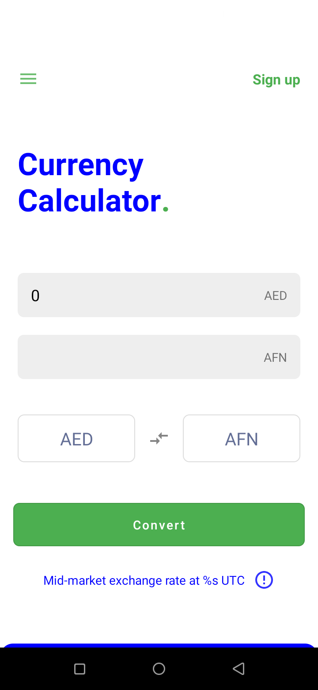
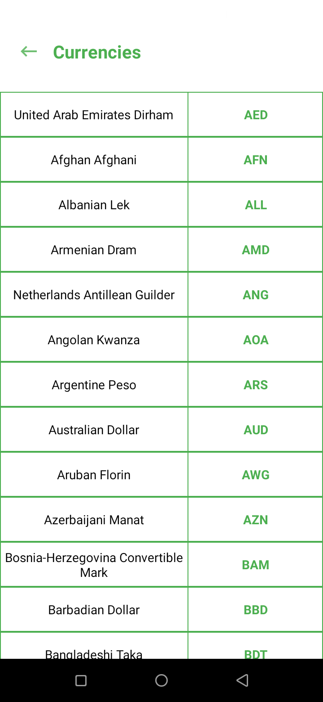

# Abu

 
 

Welcome to Abu! 
An awesome app that helps you do your currency conversions.

 
 

### Technologies used:

* Kotlin Coroutines
* Koin
* Room
* Retrofit
* Firebase (Authentication, Firestore)

 
 

### App features:

* Currency Conversion
* Accessing currency symbols
* Authentication (not a requirement)
* UserProfile storage and editing (local and remote)

 
 

### Requirements:

Android smartphone (min SDK: 19)

 
 

### Installation:

* The app can be installed by cloning this project or directly from <a href="https://drive.google.com/drive/folders/1hBEChGsWW7z8Kpw1MG6_LhimnTyK0xv_?usp=sharing"><b>Google Drive</b></a>.

 
 

### Preview:

      
  

  
  
  

  

